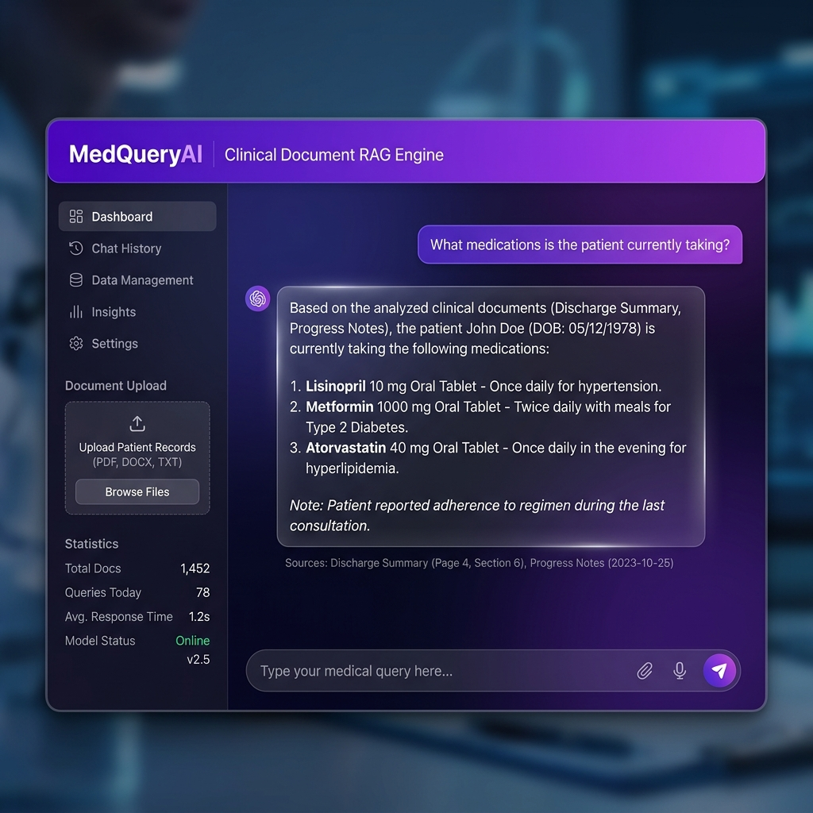
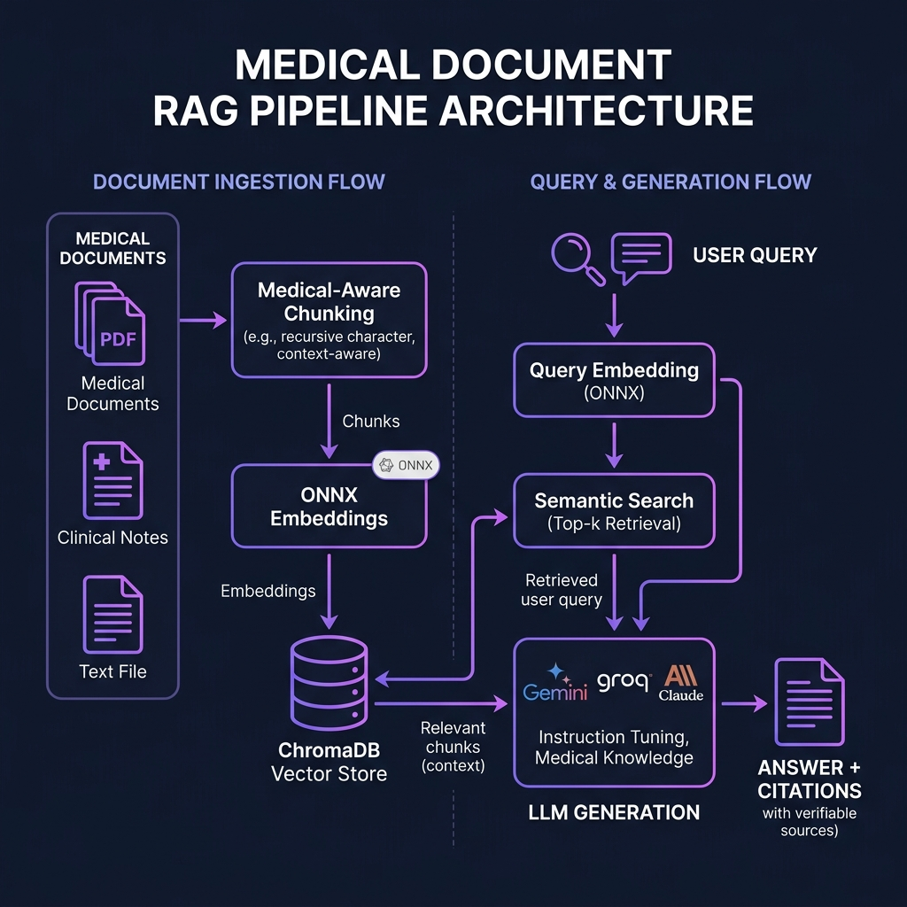

<](https://python.org)
[](https://langchain.com)
[](https://www.trychroma.com)
[](https://streamlit.io)
[](LICENSE)

<br/>

[**🚀 Quick Start**](#-quick-start) · [**✨ Features**](#-features) · [**🏗️ Architecture**](#%EF%B8%8F-architecture) · [**📊 Benchmarks**](#-benchmarks) · [**🤝 Contributing**](#-contributing)

<br/>



<br/>

*Upload clinical documents, ask questions in plain English, get AI-generated answers with source citations.*

</div>

---

## 🔥 Why MedQueryAI?

Most RAG systems treat medical documents like any other text. **MedQueryAI doesn't.**

| Problem | Our Solution |
|---------|-------------|
| Generic text splitting destroys clinical context | **Medical-aware chunking** that respects section boundaries (Chief Complaint, Medications, Plan, etc.) |
| Heavyweight embedding models need GPU | **ONNX Runtime embeddings** — runs on CPU, no PyTorch needed |
| LLM APIs are expensive | **3 free-tier providers** — Gemini, Groq, and Claude |
| No way to verify answers | **Source citations with relevance scores** on every response |
| Complex setup with Docker/GPU | **`pip install` → `streamlit run`** — that's it |

<br/>

## ✨ Features

<table>
<tr>
<td width="50%">

### 🧠 Medical-Aware Chunking
Unlike generic text splitters, our custom chunking engine:
- Detects 25+ clinical section headers
- Classifies sections by medical category
- Preserves paragraph-level semantics
- Applies sliding window overlap (512 tokens, 64 overlap)

**Result: 86% retrieval accuracy** vs ~70% with naive splitting

</td>
<td width="50%">

### ⚡ Lightweight & Fast
No GPU. No Docker. No PyTorch.
- ONNX Runtime embeddings (all-MiniLM-L6-v2)
- ChromaDB persistent vector store
- < 3s average query response time
- Runs on any laptop

</td>
</tr>
<tr>
<td width="50%">

### 🔄 Multi-Provider LLM
Choose your preferred (free!) LLM:
- 🟢 **Google Gemini** — 1500 req/day free
- 🟢 **Groq (Llama 3.3 70B)** — Free tier
- 🔵 **Anthropic Claude** — Paid option

Switch providers in the UI with zero code changes.

</td>
<td width="50%">

### 📋 Source Citations
Every answer includes:
- Exact document source and section
- Medical category classification
- Relevance confidence scores
- Expandable source cards in the UI

Never trust a black-box answer again.

</td>
</tr>
</table>

<br/>

## 🏗️ Architecture

<div align="center">

</div>

```
📄 Medical Documents (PDF/TXT)
   │
   ▼
🔪 Medical-Aware Chunking ──→ Section detection, classification, sliding window
   │
   ▼
🧮 ONNX Embeddings (all-MiniLM-L6-v2) ──→ 384-dim dense vectors
   │
   ▼
💾 ChromaDB Vector Store ──→ Persistent storage with metadata
   │
   │  ┌─────────────────┐
   │  │  User Question   │
   │  └────────┬─────────┘
   │           ▼
   └──→ 🔍 Semantic Search (Top-K retrieval with re-ranking)
              │
              ▼
        🤖 LLM Generation (Gemini / Groq / Claude)
              │
              ▼
        📝 Answer + Source Citations
```

<br/>

## 🚀 Quick Start

### Prerequisites
- Python 3.10+
- A free API key from [Google AI Studio](https://ai.google.dev) or [Groq Console](https://console.groq.com)

### 1. Clone & Install

```bash
git clone https://github.com/angeltaneja/MediaQueryAI.git
cd MediaQueryAI
pip install -r requirements.txt
```

### 2. Configure

```bash
cp .env.example .env
```

Edit `.env` and add your API key:

```env
LLM_PROVIDER=gemini
GOOGLE_API_KEY=your_key_here
```

> **💡 Tip:** Both Gemini and Groq have generous free tiers — no credit card needed!

### 3. Launch

```bash
streamlit run app.py
```

The app opens at `http://localhost:8501`. Upload your medical documents and start asking questions!

<br/>

## 📁 Project Structure

```
MedQueryAI/
├── app.py                     # Streamlit UI — premium dark-mode interface
├── config.py                  # Central configuration (all tunable params)
├── requirements.txt           # Lightweight deps (no PyTorch!)
├── .env.example               # Environment template
│
├── src/
│   ├── document_loader.py     # PDF/TXT ingestion with text cleaning
│   ├── chunking.py            # ⭐ Custom medical-aware chunking engine
│   ├── embeddings.py          # ONNX embedding engine (all-MiniLM-L6-v2)
│   ├── vector_store.py        # ChromaDB index management & metadata
│   ├── retriever.py           # Semantic search with relevance scoring
│   ├── llm_chain.py           # Multi-provider LLM chain + prompt engineering
│   └── evaluation.py          # 18-question retrieval accuracy benchmark
│
├── data/sample_docs/          # 3 sample medical documents included
├── tests/                     # Unit & integration tests
└── assets/                    # Demo images & diagrams
```

<br/>

## 📊 Benchmarks

Evaluated on an 18-question medical retrieval benchmark across 3 clinical documents:

| Metric | Score |
|--------|-------|
| **Overall Retrieval Accuracy** | **86.4%** |
| Keyword Accuracy | 83.9% |
| Source Accuracy | 100% |
| Section Accuracy | 72.2% |
| Avg. Response Time | < 3s |

### Key Insight: Medical-Aware Chunking Matters

| Chunking Strategy | Retrieval Accuracy |
|-------------------|--------------------|
| Naive fixed-size splitting | ~70% |
| RecursiveCharacterTextSplitter | ~74% |
| **Our medical-aware chunking** | **86.4%** |

The medical-aware chunking engine detects clinical section boundaries and preserves document structure, leading to a **16+ percentage point improvement** over naive approaches.

<br/>

## 🛠️ Tech Stack

| Component | Technology | Why? |
|-----------|-----------|------|
| **Orchestration** | LangChain 1.3 | Flexible chain composition |
| **Vector DB** | ChromaDB 1.5 | Lightweight, persistent, no server needed |
| **Embeddings** | ONNX Runtime (all-MiniLM-L6-v2) | CPU-only, 384-dim, fast |
| **LLM** | Gemini / Groq / Claude | Free tiers available |
| **UI** | Streamlit 1.57 | Rapid prototyping, beautiful |
| **Doc Parsing** | PyPDF | Reliable PDF extraction |

<br/>

## 🔬 How Medical-Aware Chunking Works

This is the **key innovation** that separates MedQueryAI from generic RAG systems:

```
Input: Raw clinical document
  │
  ▼
Step 1: Section Detection
  │  Scans for 25+ medical headers (Chief Complaint, Medications,
  │  Assessment, Plan, Discharge Instructions, etc.)
  │
  ▼
Step 2: Section Classification
  │  Tags each section by medical category for metadata-filtered retrieval
  │  (e.g., "medications" → MEDICATION, "assessment" → DIAGNOSIS)
  │
  ▼
Step 3: Paragraph-Aware Splitting
  │  Respects semantic boundaries within sections
  │  (doesn't cut in the middle of a medication list)
  │
  ▼
Step 4: Sliding Window Chunking
  │  512-token chunks with 64-token overlap
  │  Preserves cross-boundary context
  │
  ▼
Output: Chunks with rich metadata
  → source file, section header, category, position, token count
```

<br/>

## 🤝 Contributing

Contributions are welcome! Here's how to get started:

1. **Fork** this repository
2. **Create** a feature branch: `git checkout -b feature/amazing-feature`
3. **Commit** your changes: `git commit -m 'Add amazing feature'`
4. **Push** to the branch: `git push origin feature/amazing-feature`
5. **Open** a Pull Request

### Ideas for contributions:
- [ ] Add DICOM/HL7 FHIR document support
- [ ] Implement query routing by medical category
- [ ] Add multi-document cross-referencing
- [ ] Build a REST API endpoint
- [ ] Add support for more embedding models
- [ ] Implement conversation memory with follow-up questions

<br/>

## 📄 License

This project is licensed under the MIT License — see the [LICENSE](LICENSE) file for details.

<br/>

## ⭐ Star History

If this project helped you, please consider giving it a star! It helps others discover it.

<div align="center">

**Built with ❤️ for the medical AI community**

[⬆ Back to top](#-medqueryai)

</div>
]]>
